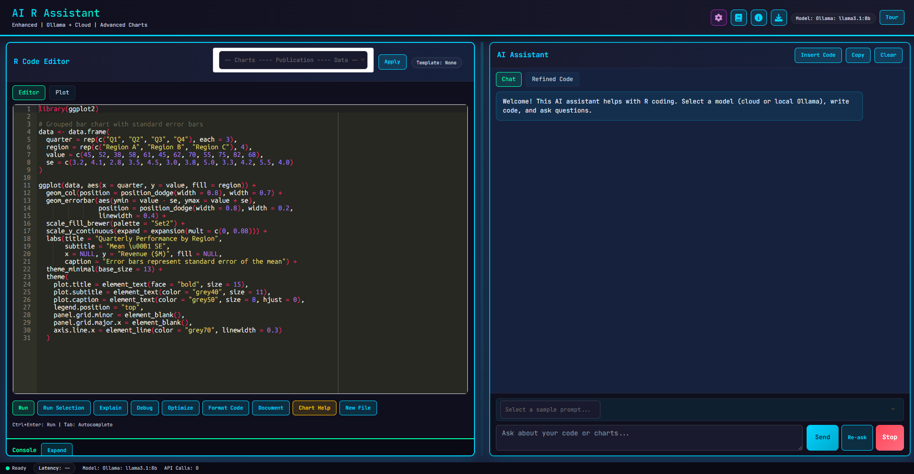
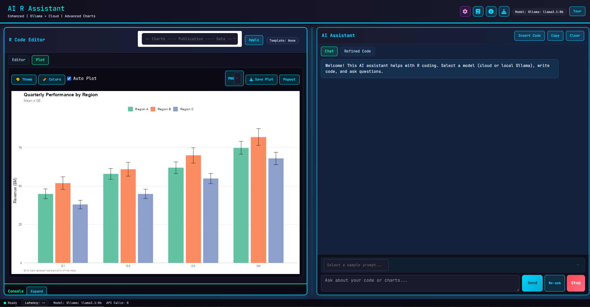
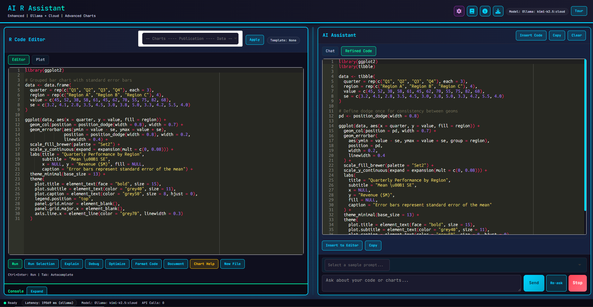

# AI-R-Assistant

An enterprise-grade Shiny application and RStudio add-in for AI-assisted R development. Combines code authoring, execution, visualization, and model-assisted reasoning in one interface.







## What this project delivers

- Local-first AI with Ollama as the default provider
- Optional cloud model providers: OpenAI, Anthropic, and Gemini
- Rich R editor with syntax highlighting, shortcuts, and template workflows
- Built-in console and plot surfaces (ggplot2 and Plotly)
- Plot popout viewer with fullscreen mode
- Streaming model responses (when `curl` is installed)
- RStudio add-in entrypoint for direct launch from IDE
- Multi-turn conversation context for follow-up questions
- Auto-fix on error: AI automatically suggests fixes when code fails
- Code diff view to see what the AI changed
- CSV/Excel data upload with interactive preview
- Interactive Plotly toggle for any ggplot
- Chart export at 300 DPI (PNG, PDF, SVG, HTML)
- Persistent API key storage in Settings
- Session save/load for chat history

## Architecture

- Canonical app code: `inst/shinyapp/app.R`
- RStudio add-in functions: `R/addin-functions.R`
- Add-in registration: `inst/rstudio/addins.dcf`
- Package metadata: `DESCRIPTION`, `NAMESPACE`

## Prerequisites

- R 4.2 or newer
- RStudio (for add-in usage)
- Ollama running locally for default workflow (`http://localhost:11434`)

Optional packages for enhanced functionality:
- `plotly`, `viridis`, `patchwork`, `scales`, `corrplot`, `curl`, `htmlwidgets`, `DT`, `readxl`

## Installation

### Install from GitHub (recommended)

```r
install.packages("devtools")
devtools::install_github("DataConceptz/AI-R-Assistant")
```

### Launch after install

```r
aiRAssistant::ai_r_assistant()
```

Or in RStudio: `Tools -> Addins -> Browse Addins -> AI R Assistant`

### Run from source (development)

1. Clone the repository:

```bash
git clone https://github.com/DataConceptz/AI-R-Assistant.git
cd AI-R-Assistant
```

2. Install required packages in R:

```r
install.packages(c(
  "shiny", "httr", "jsonlite", "shinyAce", "keyring",
  "memoise", "rintrojs", "rstudioapi", "ggplot2"
))
```

3. Run the app:

```r
shiny::runApp("inst/shinyapp")
```

## Troubleshooting

### Installation issues

If you encounter errors during installation, first install the required dependencies manually:

```r
install.packages(c(
  "shiny", "httr", "jsonlite", "shinyAce", "keyring",
  "memoise", "rintrojs", "rstudioapi", "ggplot2"
))
```

Then install the package:

```r
devtools::install_github("DataConceptz/AI-R-Assistant")
```

If you see `namespace 'promises' is already loaded, but >= X.Y.Z is required`, install from a fresh R session (not RStudio):

```r
system2(
  file.path(R.home("bin"), "Rscript"),
  c(
    "--vanilla",
    "-e",
    shQuote("install.packages('promises', repos='https://cran.rstudio.com/'); remotes::install_github('DataConceptz/AI-R-Assistant')")
  )
)
```

Then restart RStudio and run:

```r
aiRAssistant::ai_r_assistant()
```

### Launching issues

If the add-in fails to launch, try running from source:

```r
shiny::runApp("inst/shinyapp", port = 5050)
```

Ensure Ollama is running locally if using local models.

### Ollama not detected

```r
httr::GET("http://localhost:11434/api/tags")
```

If endpoint is not reachable, start Ollama service and retry.

### Add-in not visible in RStudio

- Reinstall the package and restart RStudio
- Check `inst/rstudio/addins.dcf` exists in installed package

## Model configuration

### Ollama (default)

- Default URL: `http://localhost:11434`
- Supports model refresh and connection testing from settings

#### Installing Ollama & Pulling Models

1. **Install Ollama**

   **Windows:**
   - Go to https://ollama.com/download
   - Click Download for Windows — downloads OllamaSetup.exe
   - Run the installer (no admin required)
   - Ollama starts automatically as a background service

   Verify in PowerShell:
   ```powershell
   ollama --version
   ```

   **macOS:**
   - Download the .zip from https://ollama.com/download
   - Unzip and drag Ollama.app to /Applications
   - Launch the app

   Verify:
   ```bash
   ollama --version
   ```

   **Linux:**
   ```bash
   curl -fsSL https://ollama.com/install.sh | sh
   systemctl status ollama
   ollama --version
   ```

2. **Verify the server is running**

   ```bash
   curl http://localhost:11434
   # Expected: "Ollama is running"
   ```

3. **Browse available models:** https://ollama.com/library

4. **Pull a model**

   ```bash
   ollama pull llama3.2
   ollama pull mistral:7b
   ollama pull codellama:7b
   ```

   Cloud models (require Ollama login): https://ollama.com/search?c=cloud

5. **Test a model**

   ```bash
   ollama run llama3.2
   # Type /bye or Ctrl+D to exit
   ```

6. **Manage models**

   ```bash
   ollama list          # List downloaded models
   ollama show llama3.2 # Show model details
   ollama rm llama3.2   # Remove a model
   ```

### Cloud providers

Supported: OpenAI, Anthropic, Gemini

API keys can be configured in Settings (persisted automatically), or via environment variables / keyring:
- OpenAI: `OPENAI_API_KEY` or keyring key `openai_api_key`
- Anthropic: `ANTHROPIC_API_KEY` or keyring key `anthropic_api_key`
- Gemini: `GEMINI_API_KEY` or keyring key `gemini_api_key`

## Usage flow

1. Select model provider and model.
2. Write or paste code in the editor.
3. Run code with `Ctrl+Enter` or action buttons.
4. Ask for explain/debug/optimize/document assistance.
5. Review plots in the Plot tab or pop out to fullscreen.
6. Copy or run AI-generated code from the Refined Code tab.

## File tree

```
AI-R-Assistant/
|-- R/
|   `-- addin-functions.R   (package exports)
|-- inst/
|   |-- shinyapp/
|   |   `-- app.R            (canonical app code)
|   `-- rstudio/
|       `-- addins.dcf
|-- DESCRIPTION
|-- NAMESPACE
|-- README.md
|-- CHANGELOG.md
|-- CONTRIBUTING.md
|-- SECURITY.md
`-- LICENSE
```

## Security and governance

- No telemetry is required for core functionality.
- Local Ollama mode keeps prompts/code on local machine.
- Optional cloud traffic uses HTTPS endpoints.
- See `SECURITY.md` for reporting workflow.

## Contributing

Contributions are welcome. Review:
- `CONTRIBUTING.md`
- `CODE_OF_CONDUCT.md`

## License

MIT. See `LICENSE`.
